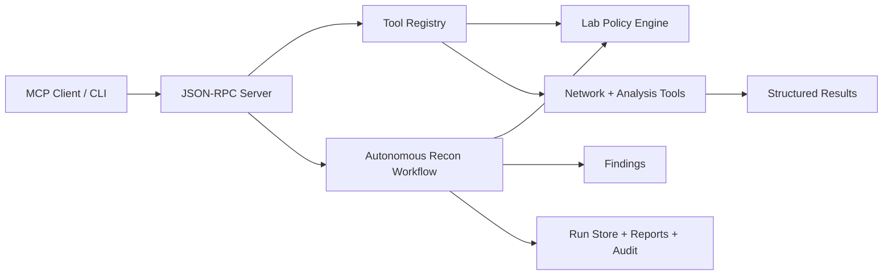

# Autonomous Security Lab Assistant

A safe-by-default MCP-style assistant for cybersecurity lab workflows. It is built as a product core, not a disposable demo: runs are persisted, actions are audited, reports are generated, and every active tool passes through policy controls before touching a target.

This project is intentionally built around the engineering skills that matter for modern agent systems:

- MCP-style JSON-RPC tool serving
- tool orchestration and workflow execution
- security guardrails before network actions
- structured evidence collection and persisted run history
- refusal paths for out-of-scope activity
- audit logs and Markdown reports
- testable backend boundaries

The current version runs without third-party runtime dependencies. That makes the safety model and protocol behavior easy to inspect, test, and extend before adding heavier integrations.

## What It Does

The assistant exposes tools that can be called by an MCP client or directly from the CLI:

- `scope.validate`: verifies a target is inside the configured lab scope
- `scan.tcp_connect`: performs a constrained TCP connect scan
- `recon.http_headers`: captures selected HTTP response headers
- `recon.tls_certificate`: inspects the certificate served by an in-scope TLS endpoint
- `recon.well_known_security`: checks `robots.txt` and `security.txt` locations
- `web.fetch_text`: fetches bounded text from an in-scope URL
- `analyze.security_headers`: turns captured headers into a basic finding
- `run.list`: lists persisted workflow runs
- `run.get`: loads a persisted run by id
- `run.search`: searches the local run index
- `workflow.autonomous_recon`: runs a scoped autonomous reconnaissance loop

By default, only loopback and private RFC1918 network ranges are allowed.

## Quick Start

Run tests:

```powershell
python -m unittest discover -s tests
```

Run the CLI workflow:

```powershell
python -m security_lab_assistant.cli recon 127.0.0.1 --ports 80,443,8000,8080
```

Launch the desktop GUI:

```powershell
python -m security_lab_assistant.gui
```

Double-click the Windows launcher:

```text
Security Lab Assistant GUI.cmd
```

Or from the CLI entry point:

```powershell
python -m security_lab_assistant.cli gui
```

Run the package directly:

```powershell
python -m security_lab_assistant gui
```

Install local command entry points:

```powershell
python -m pip install -e .
```

Then use the app command from any terminal:

```powershell
security-lab-assistant recon 127.0.0.1 --ports 8000
security-lab-assistant runs
security-lab-assistant gui
```

List saved runs:

```powershell
python -m security_lab_assistant.cli runs
```

Show a saved run:

```powershell
python -m security_lab_assistant.cli show <run_id>
```

Search saved runs:

```powershell
python -m security_lab_assistant.cli search --query 127.0.0.1 --status completed
```

Start the MCP-style JSON-RPC server:

```powershell
python -m security_lab_assistant.server
```

Then send newline-delimited JSON-RPC messages over stdin.

Example initialize message:

```json
{"jsonrpc":"2.0","id":1,"method":"initialize","params":{"clientInfo":{"name":"demo-client","version":"0.1.0"}}}
```

Example tool call:

```json
{"jsonrpc":"2.0","id":3,"method":"tools/call","params":{"name":"scope.validate","arguments":{"target":"127.0.0.1"}}}
```

## Safety Model

The safety model lives in `configs/lab_policy.json`.

Current controls:

- target allowlist by CIDR and hostname
- DNS resolution before authorization
- blocked ports
- maximum ports per scan
- rejected malformed targets, URL credentials, fragments, invalid ports, and non-object tool arguments
- deny-by-default DNS target handling unless explicitly enabled by policy
- UUID-only run retrieval to prevent path traversal
- artifact storage restricted to a relative project-local directory
- tamper-evident hash-chained audit events
- atomic writes for run, report, and SARIF artifacts
- redirect-safe HTTP probing that reports redirects without following them
- bounded HTTP response size
- structured refusal responses instead of silent failures

The assistant is designed for owned labs, CTF boxes, local services, and intentionally vulnerable training environments. Do not configure public targets unless you have explicit authorization.

## Product Features

- Durable run records in `.security_lab_assistant/runs`
- Markdown reports in `.security_lab_assistant/reports`
- SARIF exports in `.security_lab_assistant/exports`
- JSONL audit events in `.security_lab_assistant/audit/events.jsonl`
- SQLite run and audit index in `.security_lab_assistant/index.sqlite3`
- Desktop GUI for recon execution, run history, policy review, and audit verification
- Concurrent bounded TCP scanning for faster local lab reconnaissance
- Risk score and severity rollups for executive-style summaries
- Product-grade CLI commands for recon, run listing, and run inspection
- MCP-compatible tool schemas for orchestration clients
- Edge-case tests for invalid requests, unsafe targets, unsafe URLs, scan limits, and persistence
- Documented hardening posture in `SECURITY.md`

## Architecture



## Suggested Next Milestones

1. Add an official MCP SDK adapter while keeping the current dependency-light protocol tests.
2. Add a Docker Compose lab with intentionally vulnerable local targets.
3. Add an approval-gated local command tool for approved scripts only.
4. Add a richer planner with tool budgets and human approval checkpoints.
5. Export SARIF and HTML reports.

## Project Layout

```text
security_lab_assistant/
  __main__.py
  cli.py
  gui.py
  mcp_protocol.py
  policy.py
  reporting.py
  server.py
  storage.py
  tools/
  workflows/
configs/
examples/
tests/
```
