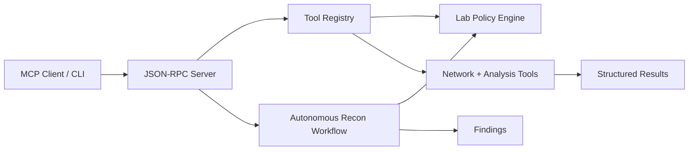

# Autonomous Security Lab Assistant

A safe-by-default MCP-style assistant for cybersecurity lab workflows.

This project is intentionally built around the engineering skills that matter for modern agent systems:

- MCP-style JSON-RPC tool serving
- tool orchestration and workflow execution
- security guardrails before network actions
- structured evidence collection
- refusal paths for out-of-scope activity
- testable backend boundaries

The first version runs without third-party runtime dependencies. That makes the safety model and protocol behavior easy to inspect, test, and extend.

## What It Does

The assistant exposes tools that can be called by an MCP client or directly from the CLI:

- `scope.validate`: verifies a target is inside the configured lab scope
- `scan.tcp_connect`: performs a constrained TCP connect scan
- `recon.http_headers`: captures selected HTTP response headers
- `web.fetch_text`: fetches bounded text from an in-scope URL
- `analyze.security_headers`: turns captured headers into a basic finding
- `workflow.autonomous_recon`: runs a scoped autonomous reconnaissance loop

By default, only loopback and private RFC1918 network ranges are allowed.

## Quick Start

Run tests:

```powershell
python -m unittest discover -s tests
```

Run the CLI workflow:

```powershell
python -m security_lab_assistant.cli recon 127.0.0.1 --ports 80,443,8000,8080
```

Start the MCP-style JSON-RPC server:

```powershell
python -m security_lab_assistant.server
```

Then send newline-delimited JSON-RPC messages over stdin.

Example initialize message:

```json
{"jsonrpc":"2.0","id":1,"method":"initialize","params":{"clientInfo":{"name":"demo-client","version":"0.1.0"}}}
```

Example tool call:

```json
{"jsonrpc":"2.0","id":3,"method":"tools/call","params":{"name":"scope.validate","arguments":{"target":"127.0.0.1"}}}
```

## Safety Model

The safety model lives in `configs/lab_policy.json`.

Current controls:

- target allowlist by CIDR and hostname
- DNS resolution before authorization
- blocked ports
- maximum ports per scan
- bounded HTTP response size
- structured refusal responses instead of silent failures

The assistant is designed for owned labs, CTF boxes, local services, and intentionally vulnerable training environments. Do not configure public targets unless you have explicit authorization.

## Architecture



## Suggested Next Milestones

1. Add an official MCP SDK adapter while keeping the current dependency-light protocol tests.
2. Add a Docker Compose lab with intentionally vulnerable local targets.
3. Add a command-execution tool that only runs approved local scripts through the same policy engine.
4. Add a richer planner with explicit phases: scope, recon, enumerate, analyze, report.
5. Export Markdown, SARIF, and JSON evidence reports.

## Project Layout

```text
security_lab_assistant/
  cli.py
  mcp_protocol.py
  policy.py
  server.py
  tools/
  workflows/
configs/
examples/
tests/
```
