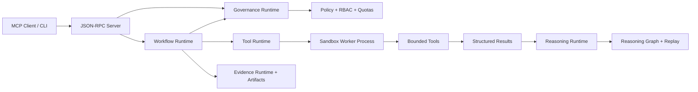

# Autonomous Security Lab Assistant

A safe-by-default MCP-style assistant for cybersecurity lab workflows. Architecturally, it is evolving into a **Trustworthy Autonomous Security Runtime**: a governed runtime for bounded, explainable, replayable security workflows.

This project is intentionally built around the engineering skills that matter for modern agent systems:

- MCP-style JSON-RPC tool serving
- tool orchestration and workflow execution
- security guardrails before network actions
- structured evidence collection and persisted run history
- refusal paths for out-of-scope activity
- audit logs and Markdown reports
- testable backend boundaries

The current version runs without third-party runtime dependencies. That makes the safety model and protocol behavior easy to inspect, test, and extend before adding heavier integrations.

For the full product-engineering roadmap, see [docs/product_roadmap.md](docs/product_roadmap.md).

## What It Does

The assistant exposes tools that can be called by an MCP client or directly from the CLI:

- `scope.validate`: verifies a target is inside the configured lab scope
- `scan.tcp_connect`: performs a constrained TCP connect scan
- `recon.http_headers`: captures selected HTTP response headers
- `recon.tls_certificate`: inspects the certificate served by an in-scope TLS endpoint
- `recon.well_known_security`: checks `robots.txt` and `security.txt` locations
- `web.fetch_text`: fetches bounded text from an in-scope URL
- `analyze.security_headers`: turns captured headers into a basic finding
- `run.list`: lists persisted workflow runs
- `run.get`: loads a persisted run by id
- `run.search`: searches the local run index
- `workflow.autonomous_recon`: runs a scoped autonomous reconnaissance loop

By default, only loopback and private RFC1918 network ranges are allowed.

## Quick Start

Run tests:

```powershell
python -m unittest discover -s tests
```

Run the CLI workflow:

```powershell
python -m security_lab_assistant.cli recon 127.0.0.1 --ports 80,443,8000,8080
```

Launch the desktop GUI:

```powershell
python -m security_lab_assistant.gui
```

Double-click the Windows launcher:

```text
Security Lab Assistant GUI.cmd
```

Or from the CLI entry point:

```powershell
python -m security_lab_assistant.cli gui
```

Run the package directly:

```powershell
python -m security_lab_assistant gui
```

Install local command entry points:

```powershell
python -m pip install -e .
```

Then use the app command from any terminal:

```powershell
security-lab-assistant recon 127.0.0.1 --ports 8000
security-lab-assistant runs
security-lab-assistant gui
security-lab-assistant batch 127.0.0.1,localhost --ports 80 --role reviewer --approved
security-lab-assistant verify
security-lab-assistant verify --deep
security-lab-assistant ops metrics
security-lab-assistant ops events
security-lab-assistant ops contracts
security-lab-assistant ops workflows
security-lab-assistant ops queue
security-lab-assistant ops failures
security-lab-assistant ops platform
```

Inspect advanced runtime intelligence for a saved run:

```powershell
security-lab-assistant runtime <run_id> explain
security-lab-assistant runtime <run_id> cognition
security-lab-assistant runtime <run_id> hypotheses
security-lab-assistant runtime <run_id> confidence
security-lab-assistant runtime <run_id> timeline
security-lab-assistant runtime <run_id> redteam
security-lab-assistant runtime <run_id> benchmark
security-lab-assistant runtime <run_id> quality
security-lab-assistant runtime <run_id> reasoning-graph
security-lab-assistant runtime <run_id> benchmark-suite
security-lab-assistant runtime <run_id> probabilistic
security-lab-assistant runtime <run_id> ai-safety
security-lab-assistant runtime <run_id> correlation
security-lab-assistant runtime <run_id> trust-calibration
security-lab-assistant runtime <run_id> simulation
security-lab-assistant runtime <run_id> diff
security-lab-assistant runtime <run_id> replay
security-lab-assistant runtime <run_id> graph
security-lab-assistant runtime <run_id> critique
security-lab-assistant runtime <run_id> integrity
```

Add `--json` to any CLI output command when another tool needs machine-readable data:

```powershell
security-lab-assistant runtime <run_id> replay --json
```

List saved runs:

```powershell
python -m security_lab_assistant.cli runs
```

Show a saved run:

```powershell
python -m security_lab_assistant.cli show <run_id>
```

Search saved runs:

```powershell
python -m security_lab_assistant.cli search --query 127.0.0.1 --status completed
```

Start the MCP-style JSON-RPC server:

```powershell
python -m security_lab_assistant.server
```

Then send newline-delimited JSON-RPC messages over stdin.

Example initialize message:

```json
{"jsonrpc":"2.0","id":1,"method":"initialize","params":{"clientInfo":{"name":"demo-client","version":"0.1.0"}}}
```

Example tool call:

```json
{"jsonrpc":"2.0","id":3,"method":"tools/call","params":{"name":"scope.validate","arguments":{"target":"127.0.0.1"}}}
```

## Safety Model

The safety model lives in `configs/lab_policy.json`.

Current controls:

- target allowlist by CIDR and hostname
- DNS resolution before authorization
- blocked ports
- maximum ports per scan
- rejected malformed targets, URL credentials, fragments, invalid ports, and non-object tool arguments
- deny-by-default DNS target handling unless explicitly enabled by policy
- UUID-only run retrieval to prevent path traversal
- artifact storage restricted to a relative project-local directory
- tamper-evident hash-chained audit events
- atomic writes for run, report, and SARIF artifacts
- redirect-safe HTTP probing that reports redirects without following them
- bounded HTTP response size
- structured refusal responses instead of silent failures

The assistant is designed for owned labs, CTF boxes, local services, and intentionally vulnerable training environments. Do not configure public targets unless you have explicit authorization.

## Product Features

- Durable run records in `.security_lab_assistant/runs`
- Markdown reports in `.security_lab_assistant/reports`
- SARIF exports in `.security_lab_assistant/exports`
- JSONL audit events in `.security_lab_assistant/audit/events.jsonl`
- SQLite run and audit index in `.security_lab_assistant/index.sqlite3`
- HTML reasoning visualizers in `.security_lab_assistant/visualizations`
- Detached HMAC artifact signatures in `.security_lab_assistant/signatures`
- Workflow event stream in `.security_lab_assistant/events`
- Local metrics stream in `.security_lab_assistant/metrics`
- Durable workflow state, queue tasks, workflow leases, and recovery metadata in the local SQLite index
- Append-only queue event stream in `.security_lab_assistant/queues/events.jsonl`
- Benchmark records in `.security_lab_assistant/benchmarks`
- Approval-gated multi-target batch orchestration with persisted batch records
- Role-based guard checks for analyst, reviewer, admin, and auditor operations
- Resource quotas for batch size, workflow events, and evidence items
- Explicit runtime contracts for governance, reasoning, tools, evidence, and workflow control
- Append-only hash-chained evidence lineage records
- Subprocess-backed secure worker execution for tool calls
- Worker capability contracts with declared operations, network scope, filesystem access, timeout, byte, memory, and concurrency limits
- Signed execution manifests with worker id, tool name, hashes, quotas, attestation, policy hash, runtime version, timestamps, and failure status
- Schema-versioned workflow state, queue task, lineage, audit, benchmark, and execution-manifest records
- Structured runtime failure taxonomy for worker, governance, replay, lineage, attestation, policy, queue, lease, signature, reasoning, quota, and recovery failures
- Signed worker output hashes linked from tool runtime metadata
- Desktop GUI for recon execution, run history, policy review, and audit verification
- Explainable runtime metadata for every workflow decision and evidence item
- Security cognitive layer with competing hypotheses, uncertainty, contradictions, and calibrated confidence
- Reasoning quality scores for evidence coverage, contradiction pressure, assumption density, hallucination risk, tool reliability, and reproducibility
- Formal directed reasoning graphs that link evidence to hypotheses, weaknesses, contradictions, and quality scores
- Typed reasoning nodes, typed reasoning edges, confidence states, graph hashes, state hashes, and replay hashes
- Security agent benchmark suite for hallucination resistance, policy bypass resistance, evidence integrity, unsafe action prevention, false positive control, and reasoning depth
- Explainability visualizer payloads for reasoning graphs, contradiction paths, and confidence evolution
- Probabilistic reasoning distributions over competing security interpretations
- AI safety research metadata for hallucination tracing, unsafe action simulation, adversarial prompt resistance, and reasoning corruption checks
- Cross-run intelligence correlation for repeated target and risk-band patterns
- Dynamic trust calibration based on evidence quality, replayability, historical context, and uncertainty
- Synthetic security simulation universe definitions for safe benchmark worlds
- Reasoning replay diffing across comparable runs
- Reasoning timeline that records how interpretations shift as evidence arrives
- Self-red-team review against weak assumptions, missing evidence, and false positives
- Investigation tree for safe next-step planning
- Benchmark checks for policy bypass resistance, hallucination resistance, reasoning quality, and evidence integrity
- Deterministic evidence replay manifests with workflow hashes
- Attack graph generation from services, assets, and findings
- Adversarial critique records for false-positive review
- Target memory snapshots for historical risk context
- Trust scores, evidence integrity roots, and formal safety claims
- Concurrent bounded TCP scanning for faster local lab reconnaissance
- Risk score and severity rollups for executive-style summaries
- Product-grade CLI commands for recon, run listing, and run inspection
- MCP-compatible tool schemas for orchestration clients
- Edge-case tests for invalid requests, unsafe targets, unsafe URLs, scan limits, and persistence
- Documented hardening posture in `SECURITY.md`

## Architecture



Runtime contracts keep authority separated: governance is deterministic and cannot execute tools, reasoning is read-only and cannot mutate policy, tools execute in subprocess workers with explicit capability contracts, evidence owns append-only lineage and signatures, and workflow coordinates state transitions without direct network IO.

## Suggested Next Milestones

1. Add an official MCP SDK adapter while keeping the current dependency-light protocol tests.
2. Add a Docker Compose lab with intentionally vulnerable local targets.
3. Add an approval-gated local command tool for approved scripts only.
4. Add a richer planner with tool budgets and human approval checkpoints.
5. Export SARIF and HTML reports.

## Project Layout

```text
security_lab_assistant/
  __main__.py
  cli.py
  gui.py
  mcp_protocol.py
  policy.py
  reporting.py
  server.py
  storage.py
  tools/
  workflows/
configs/
examples/
tests/
```
