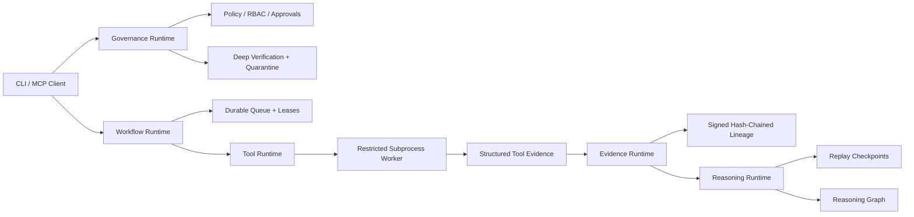
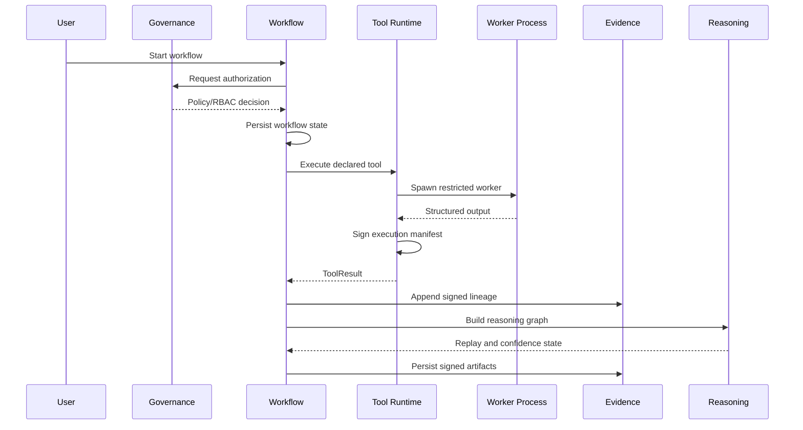
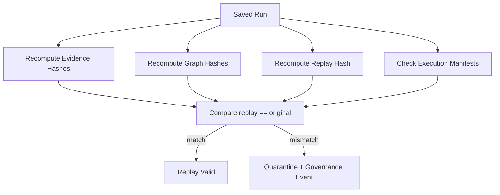

# Runtime Architecture

## Trust Boundaries

```mermaid
flowchart LR
    Client["CLI / MCP Client"] --> Governance["Governance Runtime"]
    Client --> Workflow["Workflow Runtime"]
    Governance --> Policy["Policy / RBAC / Approvals"]
    Workflow --> Queue["Durable Queue + Leases"]
    Workflow --> ToolRuntime["Tool Runtime"]
    ToolRuntime --> Worker["Restricted Subprocess Worker"]
    Worker --> Evidence["Structured Tool Evidence"]
    Evidence --> EvidenceRuntime["Evidence Runtime"]
    EvidenceRuntime --> Lineage["Signed Hash-Chained Lineage"]
    EvidenceRuntime --> Reasoning["Reasoning Runtime"]
    Reasoning --> Replay["Replay Checkpoints"]
    Reasoning --> Graph["Reasoning Graph"]
    Governance --> Verify["Deep Verification + Quarantine"]
```

## Execution Lifecycle

```mermaid
sequenceDiagram
    participant U as User
    participant G as Governance
    participant W as Workflow
    participant T as Tool Runtime
    participant P as Worker Process
    participant E as Evidence
    participant R as Reasoning

    U->>W: Start workflow
    W->>G: Request authorization
    G-->>W: Policy/RBAC decision
    W->>W: Persist workflow state
    W->>T: Execute declared tool
    T->>P: Spawn restricted worker
    P-->>T: Structured output
    T->>T: Sign execution manifest
    T-->>W: ToolResult
    W->>E: Append signed lineage
    W->>R: Build reasoning graph
    R-->>W: Replay and confidence state
    W->>E: Persist signed artifacts
```

## Replay Lifecycle

```mermaid
flowchart TD
    Run["Saved Run"] --> EvidenceHash["Recompute Evidence Hashes"]
    Run --> GraphHash["Recompute Graph Hashes"]
    Run --> ReplayHash["Recompute Replay Hash"]
    Run --> ManifestCheck["Check Execution Manifests"]
    EvidenceHash --> Compare["Compare replay == original"]
    GraphHash --> Compare
    ReplayHash --> Compare
    ManifestCheck --> Compare
    Compare -->|match| Trusted["Replay Valid"]
    Compare -->|mismatch| Quarantine["Quarantine + Governance Event"]
```
