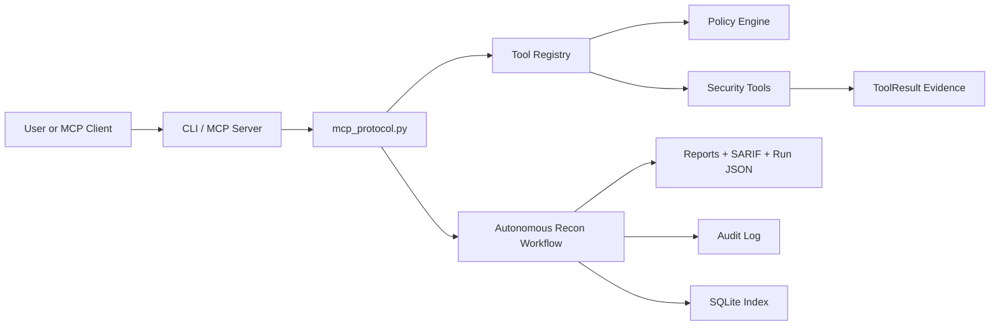

# Autonomous Security Lab Assistant: Complete Product Guide

## 1. What This Project Is

The Autonomous Security Lab Assistant is a safe-by-default cybersecurity lab assistant built around MCP-style tool orchestration.

In simple words:

This project lets an AI agent or a command-line user safely inspect authorized lab targets, collect evidence, produce security findings, save reports, and keep an audit trail.

It is not a normal chatbot. It is not a CRUD app. It is not just an API wrapper.

It is a backend security orchestration system that teaches and demonstrates:

- AI tool orchestration
- MCP-style JSON-RPC protocol design
- Cybersecurity safety controls
- Secure target validation
- Safe network reconnaissance
- Evidence collection
- Audit logging
- Report generation
- Risk scoring
- SARIF export
- CLI product design
- Testable backend architecture

The main idea is this:

An AI assistant should not directly perform arbitrary security actions. It should only call approved tools, those tools should enforce policy, and every action should create structured evidence.

## 2. Why This Project Exists

Cybersecurity tools can be dangerous if they are not controlled carefully. A poorly designed AI security assistant could accidentally scan public targets, follow unsafe redirects, leak internal errors, or execute unwanted commands.

This project exists to show how to build the safer version:

1. Validate the target before doing anything.
2. Refuse out-of-scope work.
3. Use narrow, well-defined tools.
4. Record every important action.
5. Save reports and evidence.
6. Make results auditable.
7. Keep dangerous capabilities out unless explicitly approved.

This makes it useful as a serious learning project and as a strong portfolio project for backend, cybersecurity, MCP, and AI-agent engineering.

## 3. Who Uses This

This product is designed for:

- Cybersecurity students learning safe recon workflows
- Backend engineers learning MCP-style tool servers
- AI engineers building agent tool systems
- Security researchers working inside private labs
- CTF players testing local or authorized machines
- Blue-team engineers prototyping security automation
- Teachers creating controlled security labs
- Portfolio builders who want a serious, advanced project

It is not intended for unauthorized scanning, public internet reconnaissance, exploitation, malware work, or attacking systems you do not own.

## 4. Why Someone Should Use It

Someone should use this project because it combines several valuable skills in one product:

- It shows how an AI assistant can call tools safely.
- It demonstrates secure backend design.
- It has real cybersecurity workflows.
- It creates reports and evidence.
- It has audit logging.
- It has tests for security edge cases.
- It is dependency-light and easy to inspect.

For a portfolio, this project looks stronger than a simple chatbot because it has architecture, safety boundaries, persistence, reporting, and protocol design.

## 5. Main Use Case

The main use case is:

Safely run reconnaissance against an authorized local or private lab target and produce structured output.

Example:

You have a local web service running on `127.0.0.1:8000`.

You run:

```powershell
python -m security_lab_assistant.cli recon 127.0.0.1 --ports 80,443,8000,8080
```

The assistant:

1. Checks whether `127.0.0.1` is allowed by policy.
2. Scans only the requested ports.
3. Checks open web services.
4. Collects HTTP headers.
5. Checks TLS certificates when HTTPS is detected.
6. Checks `robots.txt` and `security.txt`.
7. Extracts safe HTML page intelligence.
8. Generates findings.
9. Calculates risk.
10. Saves JSON evidence.
11. Saves a Markdown report.
12. Saves a SARIF export.
13. Writes audit events.
14. Indexes the run in SQLite.

## 6. What This Project Does

The project currently provides these capabilities:

### Scope Validation

Tool: `scope.validate`

Checks whether a target is allowed before any network action happens.

Allowed by default:

- `127.0.0.1`
- `localhost`
- Private network CIDR ranges configured in `configs/lab_policy.json`

Rejected by default:

- Public DNS names such as `example.com`
- Targets with spaces
- Targets containing ports
- Targets that look like URLs or paths
- Targets with control characters
- Out-of-scope public IP addresses

### TCP Connect Scan

Tool: `scan.tcp_connect`

Performs a constrained TCP connect scan against an in-scope target.

It is bounded by:

- Maximum ports per scan
- Blocked ports
- Timeout limits
- Maximum concurrent workers
- Target policy checks

This is not a stealth scanner or exploitation tool. It only checks whether TCP ports accept connections.

### HTTP Header Recon

Tool: `recon.http_headers`

Fetches selected HTTP response headers from an in-scope URL.

It checks headers like:

- `Server`
- `X-Powered-By`
- `Content-Security-Policy`
- `Strict-Transport-Security`
- `X-Frame-Options`
- `X-Content-Type-Options`
- `Referrer-Policy`
- `Permissions-Policy`

Redirects are reported but not followed by default.

### TLS Certificate Recon

Tool: `recon.tls_certificate`

Connects to an in-scope TLS endpoint and captures certificate metadata:

- Subject
- Issuer
- Validity dates
- Subject alternative names
- TLS version
- Cipher

### Well-Known Security File Check

Tool: `recon.well_known_security`

Checks:

- `/robots.txt`
- `/security.txt`
- `/.well-known/security.txt`

This helps identify public security contact information and crawler guidance on lab web services.

### Safe HTML Page Intelligence

Tool: `recon.web_page_intel`

Extracts safe structural signals from HTML:

- Number of forms
- Password input fields
- External scripts
- Inline scripts
- Links
- Meta generator tag
- Sample script sources

It does not execute JavaScript.

### Bounded Text Fetch

Tool: `web.fetch_text`

Fetches text from an in-scope URL with a maximum byte limit.

This prevents unbounded downloads.

### Security Header Analysis

Tool: `analyze.security_headers`

Turns captured HTTP headers into a finding.

It looks for missing baseline defensive headers and produces:

- Finding title
- Severity
- Missing headers
- Recommendation
- Category
- Confidence

### Autonomous Recon Workflow

Tool: `workflow.autonomous_recon`

Runs the main orchestrated workflow:

1. Validate scope.
2. Scan ports.
3. Inspect open web services.
4. Analyze headers.
5. Gather page intelligence.
6. Generate findings.
7. Score risk.
8. Save artifacts.

### Run History

Tools:

- `run.list`
- `run.get`
- `run.search`

These let users list, load, and search previous runs.

### Audit Verification

Tool: `run.verify_audit`

Verifies the hash chain for audit events.

This helps detect tampering with the audit log.

## 7. What Artifacts It Creates

When you run the workflow, the project creates a local artifact folder:

```text
.security_lab_assistant/
```

Inside it:

```text
.security_lab_assistant/
  audit/
    events.jsonl
  exports/
    <run_id>.sarif.json
  reports/
    <run_id>.md
  runs/
    <run_id>.json
  index.sqlite3
```

### Run JSON

Stored in:

```text
.security_lab_assistant/runs/
```

Contains:

- Run ID
- Target
- Objective
- Status
- Evidence
- Findings
- Warnings
- Risk score
- Report path
- SARIF path

### Markdown Report

Stored in:

```text
.security_lab_assistant/reports/
```

This is a human-readable security report.

### SARIF Export

Stored in:

```text
.security_lab_assistant/exports/
```

SARIF is a standard format that security tools and code scanning platforms can consume.

### Audit Log

Stored in:

```text
.security_lab_assistant/audit/events.jsonl
```

Each event includes:

- Timestamp
- Event type
- Payload
- Previous hash
- Event hash

This creates a tamper-evident chain.

### SQLite Index

Stored in:

```text
.security_lab_assistant/index.sqlite3
```

Used for fast run listing and searching.

## 8. How To Run It

### Requirement

Python 3.11 or newer.

This project currently has no third-party runtime dependencies.

### From This Workspace

Open PowerShell in:

```powershell
D:\MCP_Demo
```

### Run Tests

```powershell
python -m unittest discover -s tests
```

If `python` is not on PATH in this environment, use the bundled Codex Python:

```powershell
& 'C:\Users\USER\.cache\codex-runtimes\codex-primary-runtime\dependencies\python\python.exe' -m unittest discover -s tests
```

### Run Recon

```powershell
python -m security_lab_assistant.cli recon 127.0.0.1 --ports 80,443,8000,8080
```

### List Runs

```powershell
python -m security_lab_assistant.cli runs
```

### Search Runs

```powershell
python -m security_lab_assistant.cli search --query 127.0.0.1 --status completed
```

### Show One Run

```powershell
python -m security_lab_assistant.cli show <run_id>
```

Replace `<run_id>` with an actual run ID from `runs` or `search`.

## 9. How To Use It Through MCP-Style JSON-RPC

Start the server:

```powershell
python -m security_lab_assistant.server
```

The server reads newline-delimited JSON-RPC messages from stdin and writes responses to stdout.

### Initialize

```json
{"jsonrpc":"2.0","id":1,"method":"initialize","params":{"clientInfo":{"name":"demo-client","version":"0.1.0"}}}
```

### List Tools

```json
{"jsonrpc":"2.0","id":2,"method":"tools/list","params":{}}
```

### Validate Scope

```json
{"jsonrpc":"2.0","id":3,"method":"tools/call","params":{"name":"scope.validate","arguments":{"target":"127.0.0.1"}}}
```

### Run Autonomous Recon

```json
{"jsonrpc":"2.0","id":4,"method":"tools/call","params":{"name":"workflow.autonomous_recon","arguments":{"target":"127.0.0.1","ports":[80,443,8000,8080],"objective":"baseline product smoke test"}}}
```

### Search Runs

```json
{"jsonrpc":"2.0","id":5,"method":"tools/call","params":{"name":"run.search","arguments":{"query":"127.0.0.1","status":"completed","limit":10}}}
```

## 10. How The System Works Internally

At a high level:



### Main Flow

1. User runs a CLI command or sends an MCP JSON-RPC request.
2. The server parses the request.
3. The request calls a named tool.
4. The tool validates arguments.
5. The policy engine checks target and URL safety.
6. The tool performs a bounded action.
7. The result is returned as structured JSON.
8. If using the workflow, results are saved as artifacts.

## 11. File-By-File Explanation

### `pyproject.toml`

Defines the Python package.

Important fields:

- Project name: `autonomous-security-lab-assistant`
- Version: `0.4.0`
- Python requirement: `>=3.11`
- Console scripts:
  - `security-lab-mcp`
  - `security-lab-cli`

### `configs/lab_policy.json`

Defines safety policy.

Important settings:

- `allowed_cidrs`: allowed IP ranges
- `allowed_hostnames`: explicitly allowed names
- `allow_dns_targets`: whether arbitrary DNS names are allowed
- `blocked_ports`: ports that cannot be scanned
- `allowed_schemes`: allowed URL schemes
- `max_tcp_ports_per_scan`: scan size limit
- `max_scan_workers`: concurrency limit
- `max_http_bytes`: HTTP response size limit
- `artifacts_dir`: where artifacts are saved

### `security_lab_assistant/models.py`

Defines core data models.

Key classes:

- `ToolResult`
- `Finding`
- `RunContext`

`ToolResult` represents the output of one tool.

`Finding` represents a security issue or observation.

`RunContext` stores the state of an entire workflow run.

### `security_lab_assistant/policy.py`

The security gatekeeper.

This file:

- Loads policy from JSON
- Normalizes targets
- Rejects invalid targets
- Resolves allowed targets
- Checks CIDR scope
- Validates ports
- Validates URLs
- Restricts artifact storage to the project

Important functions:

- `LabPolicy.from_file`
- `LabPolicy.assert_target_allowed`
- `LabPolicy.assert_port_allowed`
- `LabPolicy.assert_port_scan_allowed`
- `LabPolicy.assert_url_allowed`
- `normalize_target`
- `load_default_policy`

### `security_lab_assistant/validation.py`

Shared argument validation helpers.

It prevents unsafe inputs from reaching tool logic.

Important functions:

- `require_string`
- `require_run_id`
- `bounded_optional_string`
- `parse_limit`
- `parse_status`
- `parse_timeout`
- `parse_ports`

### `security_lab_assistant/tools/base.py`

Defines the tool abstraction.

Important pieces:

- `ToolSpec`
- `ToolHandler`
- `refused`

`refused` turns a policy failure into a structured tool result instead of crashing.

### `security_lab_assistant/tools/scope.py`

Implements:

- `scope.validate`

It checks whether a target is inside allowed scope.

### `security_lab_assistant/tools/network.py`

Implements network and web recon tools.

Important functions:

- `tcp_connect_scan`
- `_probe_tcp_port`
- `http_headers`
- `fetch_text`
- `well_known_security`
- `tls_certificate`
- `web_page_intel`

Security choices:

- Bounded timeouts
- Bounded port count
- Concurrent scans limited by policy
- Redirects not followed
- HTTP body size limited
- HTML parsed but scripts not executed

### `security_lab_assistant/tools/reporting.py`

Implements:

- `analyze.security_headers`

It checks for missing defensive headers and produces a structured finding.

### `security_lab_assistant/tools/runs.py`

Implements run management tools.

Tools:

- `run.list`
- `run.get`
- `run.search`
- `run.verify_audit`

Security choices:

- UUID-only run lookup
- Bounded limits
- Valid status values only
- Audit chain verification

### `security_lab_assistant/tools/registry.py`

The central tool registry.

Every tool exposed to MCP is registered here with:

- Name
- Description
- Input schema
- Handler function

The server uses this registry when clients call tools.

### `security_lab_assistant/workflows/autonomous_recon.py`

The main autonomous workflow.

It performs:

1. Input validation
2. Scope validation
3. TCP scan
4. Web service recon
5. Header analysis
6. TLS recon
7. Page intelligence
8. Finding creation
9. Risk scoring
10. Report generation
11. Artifact persistence
12. Audit logging

### `security_lab_assistant/storage.py`

Handles persistence.

It creates:

- Artifact directories
- JSON run files
- Markdown reports
- SARIF exports
- SQLite index
- Audit log

Security choices:

- Artifact directory cannot be absolute
- Artifact directory must stay inside project root
- Symlink artifact directories are rejected
- Atomic writes are used
- Run ID lookup is UUID-only
- SQLite queries are parameterized
- Audit events are hash-chained

### `security_lab_assistant/reporting.py`

Renders human-readable Markdown reports.

It includes:

- Run metadata
- Risk score
- Severity summary
- Findings
- Evidence

### `security_lab_assistant/risk.py`

Calculates a risk score.

Inputs:

- Finding severity
- Open service count
- Warning count

Output:

- Numeric score
- Risk band
- Driver breakdown

### `security_lab_assistant/sarif.py`

Creates SARIF output.

SARIF lets security findings be consumed by security platforms and code scanning tools.

### `security_lab_assistant/mcp_protocol.py`

Implements MCP-style JSON-RPC request handling.

Supported methods:

- `initialize`
- `tools/list`
- `tools/call`
- `notifications/initialized`

Security choices:

- Request must be a JSON object
- Method must be a string
- Params must be an object
- Tool name must be a string
- Tool arguments must be an object

### `security_lab_assistant/server.py`

Runs the stdio JSON-RPC server.

It:

- Reads stdin line by line
- Parses JSON
- Calls `handle_request`
- Writes JSON-RPC responses

Security choice:

Internal errors do not expose raw exception details to the client.

### `security_lab_assistant/cli.py`

Provides command-line commands:

- `recon`
- `runs`
- `search`
- `show`

This is useful when testing without an MCP client.

### `tests/`

Contains regression tests.

Current test themes:

- Policy enforcement
- Tool refusal behavior
- MCP protocol validation
- Run persistence
- SARIF export
- Risk scoring
- SQLite search
- Audit verification
- Path traversal defense
- Invalid URL defense
- Invalid limit defense
- DNS deny-by-default behavior

## 12. Line-By-Line Style Walkthrough Of The Main Workflow

The most important flow is in:

```text
security_lab_assistant/workflows/autonomous_recon.py
```

Conceptually, it does this:

```python
target = require_string(arguments, "target")
```

This gets the target and rejects empty or unsafe strings.

```python
ports = parse_ports(arguments.get("ports", COMMON_WEB_PORTS))
```

This parses ports, rejects booleans and invalid values, deduplicates them, and sorts them.

```python
ctx = RunContext(target=target, objective=objective)
```

This creates a run object to hold evidence, findings, phases, status, and warnings.

```python
append_audit_event(policy, "workflow.started", ...)
```

This writes an audit event before the workflow does real work.

```python
scope = ctx.add_result(_call_tool("scope.validate", ...))
```

This validates the target before scanning.

If scope validation fails:

```python
ctx.status = "refused"
save_run(...)
return ToolResult(...)
```

The workflow stops, saves a refused run, and returns a structured refusal.

If scope validation succeeds:

```python
scan = ctx.add_result(_call_tool("scan.tcp_connect", ...))
```

It performs a bounded TCP scan.

Then:

```python
open_ports = [...]
```

It extracts only open ports.

For each open web port:

```python
headers = ctx.add_result(_call_tool("recon.http_headers", ...))
```

It captures HTTP headers.

For HTTPS:

```python
ctx.add_result(_call_tool("recon.tls_certificate", ...))
```

It collects TLS metadata.

Then:

```python
ctx.add_result(_call_tool("recon.well_known_security", ...))
ctx.add_result(_call_tool("recon.web_page_intel", ...))
```

It checks common security files and safe page indicators.

Then:

```python
analysis = ctx.add_result(_call_tool("analyze.security_headers", ...))
```

It converts header observations into a finding.

At the end:

```python
report = render_markdown_report(ctx)
sarif = render_sarif(ctx)
run_path = save_run(policy, ctx, report, sarif)
```

It creates all persistent artifacts.

Finally:

```python
return ToolResult(...)
```

It returns a structured product response with run ID, status, risk, warnings, findings, and artifact paths.

## 13. Security Model In Plain English

The system follows this rule:

Nothing touches a target until policy allows it.

Important protections:

- It refuses public DNS names by default.
- It refuses public IPs unless policy allows them.
- It refuses malformed targets.
- It refuses path traversal run IDs.
- It refuses absolute artifact directories.
- It refuses URL credentials.
- It refuses URL fragments.
- It refuses unsafe ports.
- It refuses too many ports.
- It refuses negative limits.
- It does not execute shell commands.
- It does not execute JavaScript.
- It does not follow redirects automatically.
- It saves audit events.
- It can verify audit log integrity.

## 14. What This Does Not Do

This project does not:

- Exploit vulnerabilities
- Brute force passwords
- Run malware
- Execute arbitrary shell commands
- Scan arbitrary public internet targets by default
- Bypass authentication
- Perform stealth scanning
- Replace professional security testing

This is intentional. The project is designed to be defensible and safe.

## 15. How To Test It

Run all tests:

```powershell
python -m unittest discover -s tests
```

Expected result:

```text
Ran 28 tests
OK
```

Run compile check:

```powershell
python -m compileall security_lab_assistant tests
```

Run a CLI smoke test:

```powershell
python -m security_lab_assistant.cli recon 127.0.0.1 --ports 80
```

Run an MCP smoke test:

```powershell
Get-Content examples\mcp_tools_list.json | python -m security_lab_assistant.server
```

## 16. Example Output Explained

A recon run returns something like:

```json
{
  "ok": true,
  "data": {
    "run_id": "44da8f18-1368-425a-85d8-ee1e519e6a2f",
    "target": "127.0.0.1",
    "status": "completed",
    "open_ports": [],
    "risk": {
      "score": 2,
      "band": "low"
    },
    "warnings": [
      "No open ports were detected in the requested scan set."
    ],
    "run_path": "...runs\\44da8f18-1368-425a-85d8-ee1e519e6a2f.json",
    "report_path": "...reports\\44da8f18-1368-425a-85d8-ee1e519e6a2f.md",
    "sarif_path": "...exports\\44da8f18-1368-425a-85d8-ee1e519e6a2f.sarif.json"
  }
}
```

Meaning:

- `ok`: whether the workflow completed without tool-level refusal
- `run_id`: unique identifier for this run
- `target`: inspected host
- `status`: final workflow status
- `open_ports`: ports found open
- `risk`: risk score and severity band
- `warnings`: non-fatal observations
- `run_path`: raw evidence JSON
- `report_path`: human-readable report
- `sarif_path`: machine-readable security export

## 17. How To Present This Project

You can describe it like this:

Autonomous Security Lab Assistant is a safe-by-default MCP-style security orchestration backend. It validates scope before action, exposes narrow security tools through structured schemas, performs bounded recon against authorized lab targets, persists evidence, generates reports, exports SARIF, maintains a SQLite run index, and records tamper-evident audit logs.

Shorter version:

It is a secure AI-agent tool server for authorized cybersecurity lab reconnaissance.

## 18. Why It Looks Like A Serious Product

It has product-level pieces that prototypes usually miss:

- Clear safety policy
- Tool registry
- Protocol layer
- CLI layer
- Workflow layer
- Persistence layer
- Report layer
- Audit layer
- Risk scoring
- SARIF export
- Searchable run index
- Security tests
- Security documentation
- No third-party dependency sprawl

## 19. Common Questions

### Is this an MCP server?

It is an MCP-style JSON-RPC server. It supports MCP-like methods such as `initialize`, `tools/list`, and `tools/call`. A future improvement would be adding an official MCP SDK adapter.

### Can it scan public websites?

Not by default. DNS targets are disabled by default and public IPs are refused unless the policy is deliberately changed.

### Is it safe?

It is designed to be safe-by-default for lab use. No software can honestly claim zero vulnerabilities, but this project has strong guardrails and tests.

### Does it exploit systems?

No.

### Does it run shell commands?

No.

### Why does it save so many files?

Because serious security tools need evidence, reports, exports, auditability, and history.

## 20. Future Improvements

Strong next steps:

- Add official MCP SDK integration
- Add authenticated HTTP transport
- Add Docker Compose vulnerable lab targets
- Add HTML report export
- Add approval-gated local command execution for known safe scripts only
- Add CI pipeline
- Add type checking
- Add signed release builds
- Add file permission hardening
- Add role-based policies
- Add workflow budgets and human approval gates

## 21. Summary

This project is a professional, security-focused AI tooling backend.

It teaches how to combine:

- AI agents
- MCP architecture
- Cybersecurity guardrails
- Backend engineering
- Security reporting
- Persistent evidence
- Auditability
- Testing

The most important design principle is:

Policy first, tools second, evidence always.

